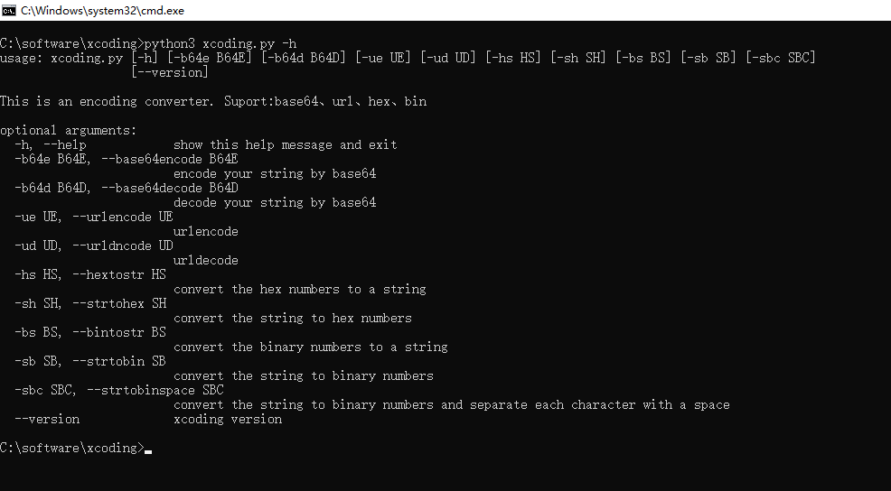
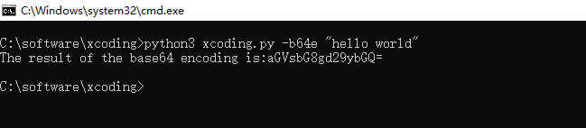
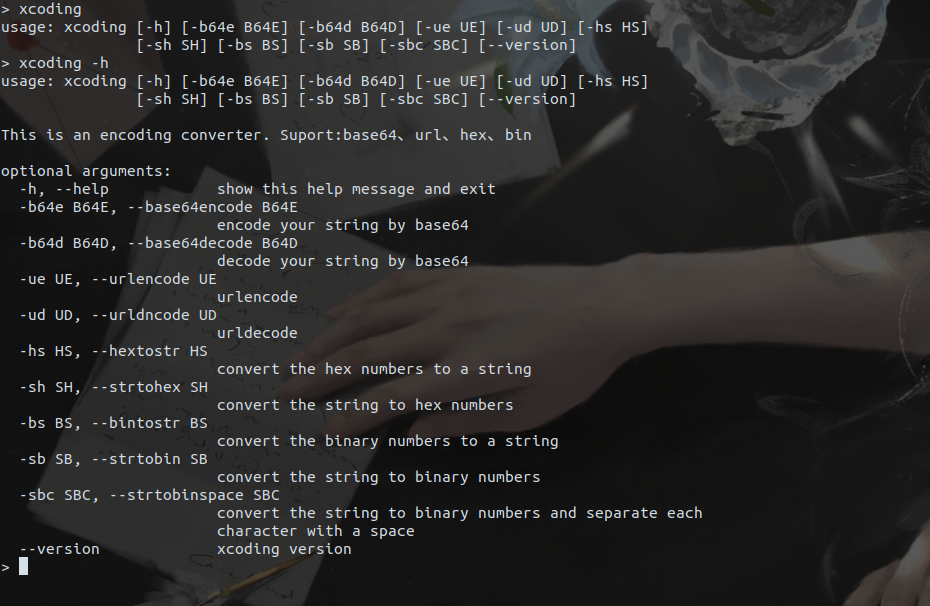

# xcoding
作者:4ut15m

## 简介
这是一个编码转换工具，包含base64编码解码，url编码解码，字符串转ASCII码十六进制数，十六进制数转字符串，字符串转二进制数以及二进制数转字符串。
使用环境为python3

## 用法

详细用法可见-h ,--help选项

e.g.

python3 xcoding -h

python3 xcoding -b64e "要进行base64编码的字符串"

linux用户可以创建一个软连接

sudo ln -s xcoding_path /usr/bin/xcoding

而后便可以直接使用xcoding来运行工具而不再需要加python3,例如

xcoding -h

xcoding -b64e "要进行base64编码的字符串"

